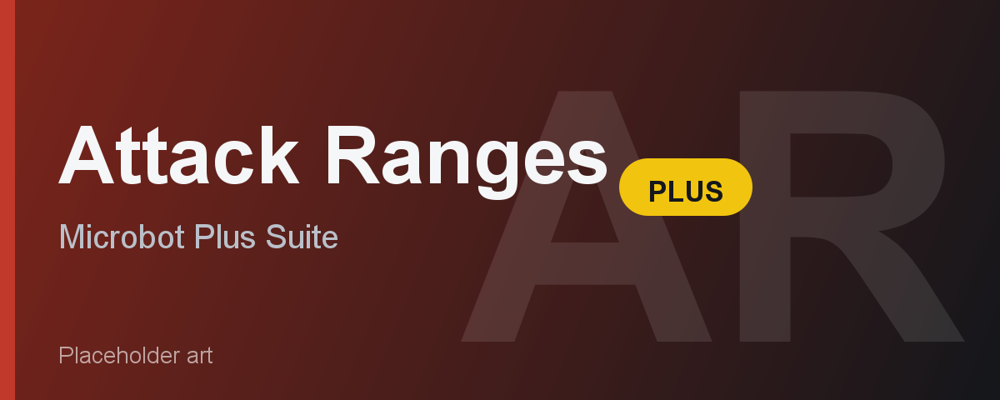

# Attack Ranges Plus

Attack Ranges Plus draws a live ground outline showing every tile you can actually reach with your current weapon and attack style, clipped to line of sight so the shape molds around walls and obstacles. It is part of the Microbot "Plus" suite of overlay and utility plugins.

---

## Feature Overview

| Feature | Description |
|---------|-------------|
| **Attack style - Auto (detect)** | Reads your equipped weapon and selected attack style to show your exact reach - long-range, autocast spell range, halberds at 2 tiles, melee at 1. Recommended. |
| **Attack style - Melee / Ranged / Magic** | Fixed overrides: Melee forces 1 tile, Ranged forces 7 tiles (representative preview), Magic forces 10 tiles (use this when you click-cast without autocast set). |
| **Line color** | Color of the attack-range outline drawn on the ground. |
| **Fill area** | Shades the tiles inside your attack range. Off by default - the fill is repainted every frame and costs FPS at large ranges such as magic. The outline alone is cheap. |
| **Fill color** | Color and opacity of the shaded area (used only when Fill area is on). |
| **Show overlay** | Controls when the overlay appears: Always, In PvP areas (Wilderness, PvP/Deadman worlds, and PvP-flagged zones), or Wilderness only. |
| **Show target's range** | Also outlines the attack range of the player you are currently fighting, based on their equipped weapon's base reach. |
| **Target line color** | Outline color used for the target's range indicator. |

---

## Requirements

- Microbot RuneLite client
- No skill level, quest, or item requirements - the overlay works with any weapon and style
- Works in F2P and P2P; PvP-specific visibility modes are useful in the Wilderness, PvP worlds, and Deadman worlds

---

## How It Works

1. Enable the plugin from the Microbot plugin list and configure your preferred settings.
2. Log in and equip your weapon. With Attack style set to Auto, the plugin reads your weapon and active attack style each frame.
3. The overlay computes the Chebyshev (king-move) attack square from your position, then clips it to only the tiles you have line of sight to - matching where shots and strikes actually connect.
4. The resulting area is outlined along its outer edge. If Fill area is enabled, the tiles inside are shaded as well.
5. If Show target's range is on and you are interacting with another player, a second outline appears around the tiles they can reach from their position.
6. The outline updates in real time as you move, rotate the camera, or change weapons.

---

## Configuration

Set **Attack style** to Auto for accurate real-time detection. Use the fixed overrides only when you want to preview a style before switching gear, or when you click-cast spells without an autocast configured (use Magic in that case).

Set **Show overlay** to "In PvP areas" or "Wilderness only" if you only want the overlay active during PvP content - this keeps your screen clean during PvM.

**Target's range** is useful for PvP spacing but has limits - see Limitations below.

---

## Limitations

- **Your own range works everywhere** (PvM and PvP) because it is based on your own equipped weapon and style. The target outline is players only - RuneLite does not expose NPC attack ranges, so the overlay cannot be drawn for monsters without hardcoding per-boss data.
- **Target's range is approximate.** Another player's attack-style varbits are not readable, so the target outline uses their equipped weapon's base reach. It does not account for the long-range modifier and cannot detect whether a staff user is autocasting or click-casting.
- Auto magic detection requires an autocast spell to be set. If you click-cast without autocast, use the Magic style override.
- Line-of-sight is computed in world coordinates and is not designed for instanced areas. This is generally not relevant for Wilderness and PvP use cases.

---

## Credits

Originally ported from [ry-java/AttackRanges2](https://github.com/ry-java/AttackRanges2) and rebuilt for the Microbot client.
