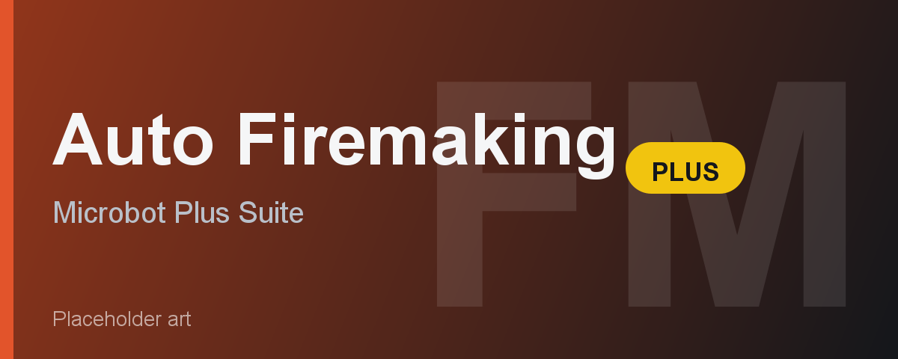

# Auto Firemaking Plus

Auto Firemaking Plus trains Firemaking on a bank-and-burn loop with two selectable methods, progressive log selection, and a live statistics overlay. It is part of the Microbot "Plus" suite and shares the same stop-condition system and overlay as the other Plus plugins. It is fully F2P friendly.

---

## Feature Overview

| Feature | Description |
|---------|-------------|
| **Method** | Forester's Campfire (default, AFK) or Line firemaking (higher XP/hr). |
| **Forester's Campfire** | Adds logs to a nearby campfire or fire. If none is found, the bot lights its own with a tinderbox, then burns on it. Once a fire is established you rarely move. |
| **Line firemaking** | Lights a horizontal line of fires stepping west, walks back, banks, and repeats. Needs an open run of tiles. |
| **Log type** | Which logs to burn. Ignored when Progressive is on. |
| **Progressive** | Burns the best logs your current level allows: Logs (1), Oak (15), Willow (30), Teak (35), Maple (45), Mahogany (50), Yew (60), Magic (75), Redwood (90). |
| **Maximize log space** | Campfire method only. When a campfire is already active nearby, the tinderbox is banked so a 28th log is carried; otherwise a tinderbox is kept to light a new fire. |
| **Scan radius** | Line firemaking only. How far around the start tile to search for an open row (range 10 to 50). |
| **Stop conditions** | Stop after minutes, XP gained, or Target level. The bot banks before shutting down. |
| **League mode (anti-AFK)** | Periodically presses a key to reset the idle-logout timer. |
| **Speed mode** | Disables Microbot antiban for faster throughput. More detectable, throwaway accounts only. |
| **Live overlay** | Current level (and levels gained), XP gained, XP/hr, logs burnt, log cost/hr, runtime, target progress, ETA, and a Pause/Resume button. |

---

## Requirements

- Microbot RuneLite client
- Logs of your chosen type in the bank
- A tinderbox in the bank (used to light a fire when none is nearby)
- A bank to start next to. The Grand Exchange is ideal for the campfire method.
- F2P friendly. No quests or membership required for the standard log types.

---

## How It Works

1. Stock your bank with the logs you want to burn and a tinderbox.
2. Stand next to a bank. The Grand Exchange is recommended for the campfire method.
3. Set the Method, Log type (or enable Progressive), and any stop conditions, then enable the plugin.
4. Campfire method: the bot finds a nearby campfire or fire, or lights its own, then adds logs until the inventory is empty, banks, and repeats.
5. Line method: the bot finds an open row, lights logs while stepping west, walks back to the start, banks, and repeats.
6. When a stop condition is reached the bot banks its current inventory, then shuts itself down.

---

## Configuration

**Method** is the main choice. Forester's Campfire is the AFK option and self-sufficient: it lights its own fire if none is present, so it works even when no Forester's Campfire exists nearby. Line firemaking gives higher XP per hour but needs an open area with a clear run of tiles to the west.

**Log type** and **Progressive** control what you burn. Turn on Progressive to let the bot upgrade logs automatically as your level rises.

**Maximize log space** squeezes one extra log per trip when a campfire is already available. Banking happens on foot with teleports disabled so the bot never home-teleports away from the bank.

**Stop conditions** all default to 0 (disabled). Set any combination; the bot stops at the first one met.

---

## Limitations

- Line firemaking needs an open area with a clear westward run. In crowded or walled spots use the campfire method.
- Forester's Campfires at the Grand Exchange are temporary and burn out. The bot handles this by lighting its own fire when none is found.
- Wintertodt is out of scope; it has a dedicated minigame plugin.

---

## Credits

Auto Firemaking Plus is a from-scratch Plus build by pjmarz. The line-firemaking logic was adapted from the Microbot leagues firemaking code.
