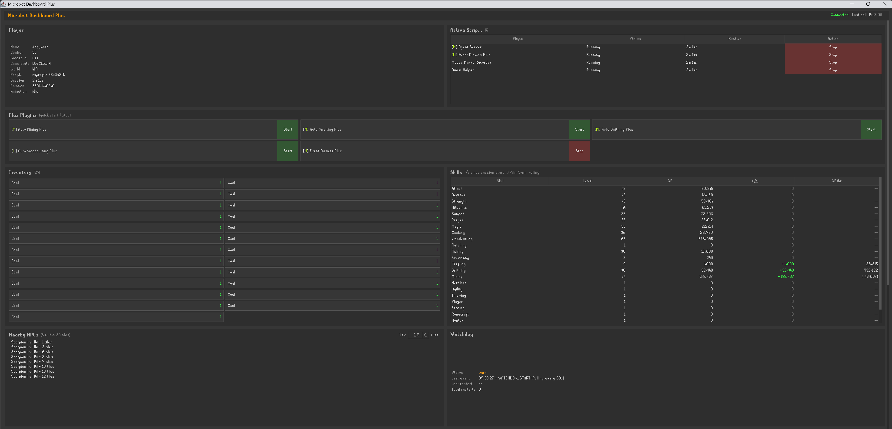
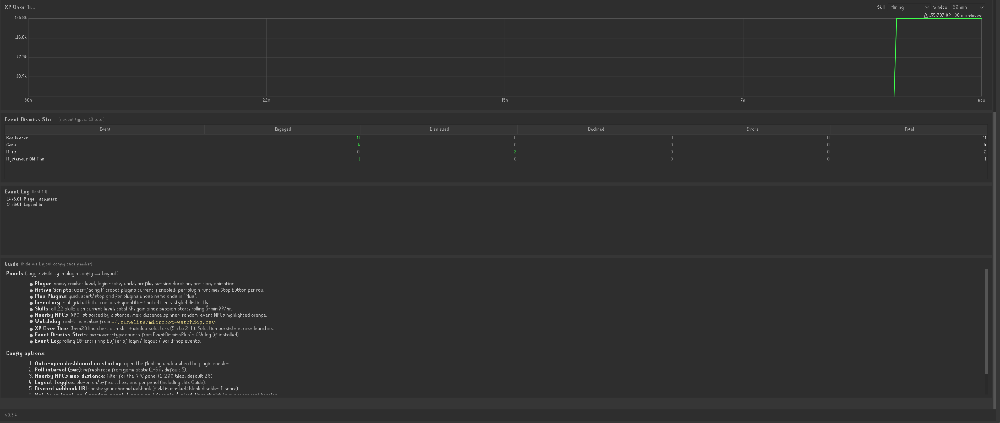
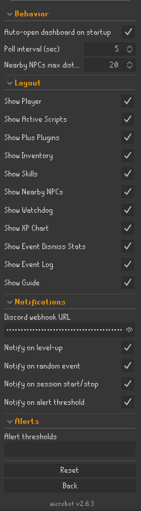

# Microbot Dashboard Plus

Microbot Dashboard Plus is a passive monitoring plugin for the Microbot RuneLite client. It opens a floating Swing window outside the game canvas with nine live-updating panels covering your session state, plus a compact sidebar panel for quick access. No HTTP server, no port binding, and no Agent Server dependency - it reads game state in-process.

---

## Feature Overview

| Feature | Description |
|---------|-------------|
| **Floating dashboard window** | A native Swing window that opens outside the game, keeping your canvas clear of stacked overlays |
| **Sidebar panel** | A compact summary in the RuneLite right toolbar with status, player, world, script count, and quick-launch buttons |
| **Player section** | Name, combat level, login state, game state, world, profile, session duration, tile position, and current animation |
| **Active Scripts section** | All enabled Microbot plugins with per-plugin runtime and a Stop button per row |
| **Inventory section** | Slot grid showing item names and quantities; noted items styled distinctly |
| **Skills section** | All 22 skills with current level, total XP, session gain, rolling 5-minute XP/hr, and an ETA to your target level |
| **Nearby NPCs section** | NPC list sorted by distance; random-event NPCs highlighted orange |
| **Antiban State section** | Tells a silent stall apart from an intentional anti-AFK pause (micro break, action cooldown, global pause, blocking event) |
| **XP Over Time chart** | Java2D line chart with skill and time-window selectors (5m to 24h) |
| **Event Log section** | Rolling 10-entry ring buffer of login, logout, and world-hop events |
| **Discord notifications** | Optional webhook for level-ups, alert threshold crossings, and session start/stop |
| **Alert thresholds** | Comma-separated SKILL:LEVEL pairs that fire an in-dashboard banner and optional Discord ping when crossed |
| **Skill targets (ETA)** | Comma-separated SKILL:LEVEL pairs that drive the ETA column in the Skills section |
| **Per-section visibility** | Toggle any of the nine panels on or off; the window updates immediately |
| **Auto-open on enable** | Dashboard window launches automatically when the plugin enables (configurable) |
| **Configurable poll rate** | Refresh interval from 1 to 60 seconds |

---

## Requirements

- Microbot RuneLite client v2.0.13 or newer
- No external dependencies - no HTTP server, no port binding, no other plugins required
- Optional: a Discord channel webhook URL for notifications

---

## How It Works

1. Enable **Microbot Dashboard Plus** from the plugin list
2. A green chart-line icon appears in the right sidebar toolbar
3. Click the icon to open the sidebar panel, then click **Open Dashboard** to launch the floating window (or enable "Auto-open dashboard on startup" to skip this step)
4. The dashboard polls game state on a background thread at the configured interval and updates all visible panels
5. The floating window remembers its size and position across launches
6. Disabling the plugin removes the sidebar icon, the panel, and the floating window cleanly

---

## Configuration

The plugin config has four sections.

**Behavior** - controls the window and polling:
- Auto-open dashboard on startup (default ON) - launches the floating window when the plugin enables
- Poll interval in seconds (default 5, range 1-60) - how often to refresh from game state
- Nearby NPCs max distance in tiles (default 20, range 1-200) - filter for the NPC section

**Layout** - nine boolean toggles, one per panel, all default ON. Untick any section to hide it; the window re-evaluates immediately.

**Notifications** - requires a Discord webhook URL in the field (masked in the UI, treated as a secret):
- Notify on level-up (default ON)
- Notify on alert threshold crossing (default ON)
- Notify on session start/stop (default OFF)

**Alerts** - two comma-separated `SKILL:LEVEL` lists:
- Alert thresholds, e.g. `MINING:60, WOODCUTTING:80`. Each threshold fires an in-dashboard banner and optional Discord ping exactly once per session.
- Skill targets (ETA), e.g. `MINING:70, AGILITY:60`. The Skills section shows an ETA to each target from the current XP per hour. A skill with no target still shows an ETA to its next level while it is being trained.

Skill names follow the OSRS API enum (uppercase).

---

## Limitations

- This plugin observes and reports only - it does not run game logic, schedule scripts, or make decisions
- Not a remote-view tool - lives in the client process with no HTTP server or LAN access
- Not for vanilla RuneLite users - requires Microbot client APIs
- The Active Scripts list is heuristic: it enumerates enabled plugins rather than reading a dedicated script registry
- The Antiban State section reads the blocking-event running flag by reflection; on a client version where that flag is not accessible it shows the handler count without the live running marker
- Skill ETAs need a non-zero XP per hour to estimate; a skill that is not currently gaining XP shows no ETA unless it has already reached its target

---

## Credits

- Original dashboard concept and Java port: pjmarz
- Iterative development via Claude Code

For issues or suggestions, open an issue on the Microbot Hub repository.
