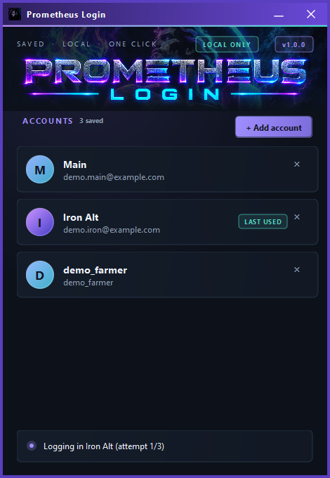

# Prometheus Login

A simple, fast way to log in to your legacy accounts. Information is stored locally only.

- **Nothing logs in on its own.** Enabling the plugin only opens the account window. An account is logged in when you click its card.
- **Add account** takes an optional name, the username or email, and the password (masked, with a Show toggle). Adding a username that is already saved updates its password. The x on a card removes it after a confirmation.
- The card you clicked last is tagged **Last used**.
- Accounts are stored **only on your own computer**, in `%USERPROFILE%\.runelite\prometheuslogin\accounts.properties`, and are read again every time the plugin starts. Passwords are encrypted with a key derived from your Windows user and computer name, so the file is useless if copied elsewhere. This is protection against casual reading, not against malware running as you. Nothing is stored in the plugin, its settings or the client's config, and nothing is sent anywhere.
- Safety limits: after a click it makes at most **3** attempts (configurable) at least 15 seconds apart, then stops so a wrong password cannot lock the account. It also stops if the login screen reports the account as banned or locked. Clicking the account again starts a fresh set of attempts.
- Settings: **Open account manager** (reopens the window), **World** (0 keeps the world already selected), **Log back in after disconnect** (off by default; only re-logs an account you clicked and that had already logged in), **Max failed attempts**.

## Limitations

- Works with accounts that sign in with a username/email and password on the client's own login screen. **Jagex accounts** sign in through the Jagex Launcher and website (which includes CAPTCHA/2FA checks), so this plugin cannot log them in.
- If a character is already logged in, log out first, then click the account.
